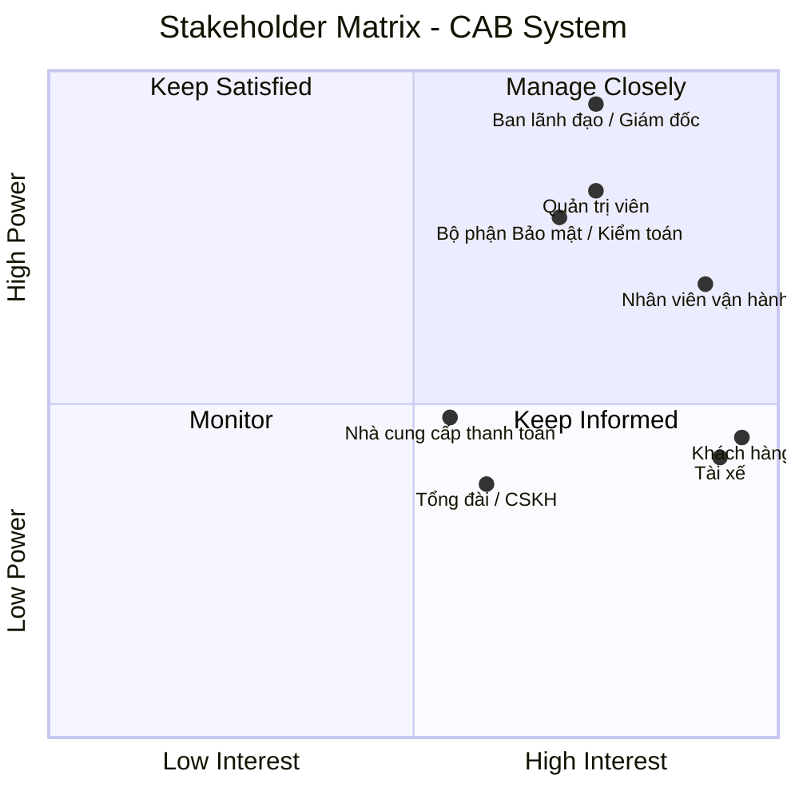

# 23646721_NguyenThiHong_cabsystem
# CAB System – Nền tảng đặt xe trực tuyến

## 1. Giới thiệu

 CAB System là một nền tảng đặt xe trực tuyến được thiết kế cho công ty ABC, nhằm thay thế cho mô hình vận hành hiện tại chủ yếu dựa trên một ứng dụng đơn giản hay thông qua tổng đài.
 Mục tiêu của dự án không chỉ dừng lại ở trình thiết lập quy trình số hóa, mà hướng dẫn xây dựng nền tảng có khả năng mở rộng lâu dài,
 phục vụ đồng thời cho ba người dùng chính của nhóm: khách hàng , tài xế và nhân viên vận hành.

 ---
 
## 2. Khó khăn của phương pháp/hệ thống truyền thống

Hệ thống hiện tại của Công ty ABC (tổng đài + app đơn giản) đang gặp phải các hạn chế sau:

| Vấn đề | Mô tả |
|---|---|
| **Phân công tài xế thủ công** | Việc ghép tài xế với khách hàng chủ yếu do con người xử lý, tốn thời gian, dễ sai sót, không tối ưu theo vị trí thực tế và không thể mở rộng khi lượng đơn tăng cao. |
| **Thiếu khả năng theo dõi trạng thái chuyến đi** | Khách hàng không biết hệ thống đang tìm tài xế, tài xế nào đã nhận chuyến, thời gian dự kiến đến hay trạng thái hiện tại — gây trải nghiệm mờ mịt, thiếu tin tưởng. |
| **Thông tin thanh toán phân tán** | Dữ liệu thanh toán chưa được quản lý tập trung, gây khó khăn cho việc đối soát, báo cáo doanh thu và xử lý sự cố giao dịch. |
| **Khó mở rộng hệ thống** | Kiến trúc hiện tại không hỗ trợ tốt việc bổ sung dịch vụ mới, phương thức thanh toán mới hay kênh thông báo mới mà không ảnh hưởng đến toàn bộ hệ thống. |
| **Rủi ro vận hành khi tải cao** | Một lỗi nhỏ (ví dụ ở chức năng thanh toán hoặc thông báo) có thể làm ngưng trệ toàn bộ hoạt động đặt xe, vì các thành phần không tách biệt và không thể scale độc lập. |
| **Thiếu công cụ quản trị & báo cáo tập trung** | Nhân viên vận hành khó theo dõi chuyến đang diễn ra, khó tra cứu lịch sử, và ban lãnh đạo thiếu dữ liệu tổng hợp về số chuyến, doanh thu, tỷ lệ hoàn thành/hủy, hiệu quả tài xế. |
| **Bảo mật & kiểm soát truy cập hạn chế** | Chưa có cơ chế xác thực, phân quyền và lưu vết thao tác rõ ràng cho dữ liệu nhạy cảm (cá nhân, vị trí, giao dịch). |

---
## 3. Những điểm mạnh mà CAB System đáp ứng
### 3.1. Trải nghiệm khách hàng liền mạch
- Đăng ký, đăng nhập, cập nhật thông tin cá nhân
- Đặt xe theo điểm đón/điểm đến, chọn loại xe
- Theo dõi trạng thái chuyến đi theo thời gian thực (đang tìm tài xế → đã nhận chuyến → đang đến → hoàn thành)
- Xem lịch sử chuyến đi, chi phí, đánh giá tài xế sau chuyến

### 3.2. Quản lý tài xế chủ động
- Đăng ký/khởi tạo tài khoản tài xế, cập nhật hồ sơ & phương tiện
- Chuyển đổi trạng thái sẵn sàng nhận chuyến
- Nhận thông báo chuyến mới, chấp nhận/từ chối chuyến
- Cập nhật trạng thái thực hiện chuyến (đến điểm đón, đón khách, di chuyển, hoàn thành)
- Ghi nhận vị trí tài xế để hỗ trợ tìm tài xế gần khách hàng và ước tính thời gian đến chính xác hơn

### 3.3. Cơ chế tìm & phân công tài xế thông minh
- Tự động xác định tài xế phù hợp dựa trên vị trí, trạng thái sẵn sàng và tiêu chí vận hành
- Ưu tiên tài xế gần và phù hợp nhất
- Tự động chuyển sang tài xế khác nếu tài xế được đề xuất không phản hồi/từ chối, **không yêu cầu khách hàng tạo lại yêu cầu**
- Thông báo rõ ràng cho khách hàng khi không tìm được tài xế phù hợp

### 3.4. Thanh toán & tính cước tập trung, an toàn
- Tự động tính cước dựa trên loại dịch vụ và thông tin chuyến đi
- Hỗ trợ đa phương thức: tiền mặt và thanh toán điện tử
- Tích hợp nhà cung cấp thanh toán bên ngoài, **không lưu trữ trực tiếp thông tin nhạy cảm của thẻ/tài khoản** trong hệ thống CAB
- Có cơ chế thông báo và xử lý lại khi giao dịch điện tử thất bại

### 3.5. Thông báo đa kênh, dễ mở rộng
- Thông báo xuyên suốt vòng đời chuyến đi cho cả khách hàng và tài xế (tiếp nhận yêu cầu, nhận chuyến, đến điểm đón, hoàn thành, kết quả thanh toán)
- Kiến trúc cho phép **bổ sung kênh thông báo mới trong tương lai mà không cần thay đổi toàn bộ hệ thống**

### 3.6. Công cụ quản trị vận hành tập trung
- Giao diện quản trị cho nhân viên vận hành: quản lý khách hàng, tài xế, phương tiện, chuyến đi
- Theo dõi chuyến đang diễn ra, xử lý chuyến gặp sự cố, tra cứu lịch sử giao dịch
- Phân quyền chặt chẽ cho các thao tác nhạy cảm
- Báo cáo tổng hợp: số lượng chuyến, doanh thu, tỷ lệ hoàn thành/hủy, hiệu quả hoạt động của tài xế

### 3.7. Kiến trúc ổn định, có khả năng mở rộng
- Các thành phần (đặt xe, thanh toán, thông báo...) hoạt động **độc lập** — lỗi ở một chức năng không làm sập toàn hệ thống
- Có thể **scale riêng từng thành phần** khi tải tăng vào giờ cao điểm
- Hỗ trợ **triển khai từng phần** (incremental deployment) cho tính năng mới, hạn chế ảnh hưởng đến hệ thống đang chạy
- Kiến trúc linh hoạt để bổ sung loại dịch vụ mới, phương thức thanh toán mới, nhà cung cấp thông báo mới, hoặc thay đổi thành phần kỹ thuật mà **không cần xây dựng lại toàn bộ ứng dụng**

### 3.8. Bảo mật & minh bạch
- Xác thực bắt buộc đối với khách hàng và tài xế trước khi sử dụng chức năng yêu cầu tài khoản
- Kiểm soát quyền truy cập chặt chẽ cho các thao tác quản trị
- Bảo vệ dữ liệu cá nhân, thông tin phương tiện, dữ liệu vị trí và dữ liệu giao dịch
- Lưu vết (audit log) các thao tác quan trọng phục vụ kiểm tra khi có sự cố

---

## 4. Các bên liên quan trong CAB System 

| STT | Tên Stakeholder | Vai trò |
|---|---|---|
| 1 | Ban lãnh đạo/giám đốc công ty | Nhà tài trợ chính (Sponsor); phê duyệt phạm vi, ngân sách, mục tiêu chiến lược mở rộng hệ thống |
| 2 | Khách hàng | Người dùng đầu cuối; tạo yêu cầu đặt xe, thanh toán, đánh giá tài xế |
| 3 | Tài xế | Người dùng đầu cuối; nhận và thực hiện chuyến đi, cập nhật trạng thái/vị trí |
| 4 | Nhân viên vận hành | Người dùng nội bộ; quản trị khách hàng/tài xế/phương tiện/chuyến đi, xử lý sự cố |
| 5 | Quản trị viên | Người dùng nội bộ có quyền cao hơn nhân viên vận hành thông thường; theo dõi doanh thu, thanh toán, thực hiện thao tác nhạy cảm |
| 6 | Bên cung cấp dịch vụ thanh toán | Đối tác/nhà cung cấp bên ngoài; xử lý thanh toán trực tuyến |
| 7 | Bộ phận Tổng đài/CSKH | Người dùng nội bộ hiện hữu; xử lý yêu cầu đặt xe qua điện thoại (kênh cũ song song hệ thống mới) |
| 8 | Bộ phận Bảo mật/Kiểm toán nội bộ | Người kiểm soát tuân thủ; đặt yêu cầu về xác thực, phân quyền, audit log |

## Stakeholder matrix

---

## 5. Mục tiêu doanh nghiệp

| # | Business Goal | Diễn giải |
|---|---|---|
| 1 | **Tăng hiệu quả vận hành, giảm phụ thuộc xử lý thủ công** | Tự động hóa việc phân công tài xế, giảm thời gian và sai sót do con người xử lý |
| 2 | **Nâng cao trải nghiệm và sự tin tưởng của khách hàng** | Cho phép khách hàng theo dõi chuyến đi theo thời gian thực, minh bạch trạng thái, chi phí |
| 3 | **Tập trung hóa và kiểm soát dữ liệu thanh toán/tài chính** | Quản lý thanh toán, đối soát tập trung, hỗ trợ báo cáo doanh thu chính xác |
| 4 | **Mở rộng quy mô kinh doanh (scale-up)** | Hệ thống phục vụ được số lượng lớn khách hàng và tài xế cùng lúc, đặc biệt vào giờ cao điểm |
| 5 | **Tăng khả năng mở rộng và thích ứng lâu dài của sản phẩm** | Dễ dàng bổ sung dịch vụ mới, phương thức thanh toán mới, kênh thông báo mới mà không phải xây lại toàn bộ hệ thống |
| 6 | **Đảm bảo tính liên tục và ổn định của dịch vụ** | Một lỗi ở một phân hệ (thanh toán, thông báo...) không được làm ngưng trệ toàn bộ hệ thống |
| 7 | **Cải thiện năng lực ra quyết định dựa trên dữ liệu** | Cung cấp báo cáo về số chuyến, doanh thu, tỷ lệ hoàn thành/hủy, hiệu quả tài xế cho ban lãnh đạo |
| 8 | **Tăng cường bảo mật và tuân thủ dữ liệu** | Bảo vệ dữ liệu cá nhân, vị trí, giao dịch; kiểm soát truy cập; lưu vết thao tác |

 ---
 
 ## 6. Các Module hệ thống 

| Tên Module | Vai trò | Các chức năng chính |
| :--- | :--- | :--- |
| **1. Auth & Authorization** (Xác thực & Phân quyền) | Đảm bảo an ninh, cấp quyền truy cập đúng người, đúng chức năng. | • Đăng ký/Đăng nhập (Khách, Tài xế, Admin). • Phân quyền Role-based. • Quản lý Token. |
| **2. Customer Management** (Quản lý Khách hàng) | Quản lý hồ sơ và dữ liệu liên quan đến người dùng đặt xe. | • Cập nhật hồ sơ cá nhân. • Xem lịch sử chuyến đi. • Lưu danh sách địa chỉ yêu thích. |
| **3. Driver Management** (Quản lý Tài xế) | Quản lý hồ sơ đối tác tài xế và trạng thái hoạt động. | • Quản lý thông tin/phương tiện. • Bật/Tắt trạng thái làm việc (Online/Offline). • Xem thu nhập cá nhân. |
| **4. Booking & Pricing** (Đặt xe & Tính cước) | Xử lý yêu cầu tạo cuốc xe và báo giá trước cho khách hàng. | • Chọn điểm Đón/Đến (Google Maps API). • Chọn loại xe (4 chỗ, xe máy). • Tính và hiển thị giá cước. |
| **5. Matching & Dispatch** (Ghép nối & Điều phối) | Tìm kiếm và phân công tài xế phù hợp nhất cho chuyến đi. | • Quét tài xế trong bán kính. • Phát cuốc xe tới tài xế. |
| **6. Ride State & Location** (Quản lý Chuyến đi) | Giám sát vòng đời cuốc xe và lưu vết tọa độ thời gian thực. | • Thay đổi trạng thái chuyến đi. • Bắn tọa độ GPS (Tài xế). • Theo dõi xe chạy (Khách). |
| **7. Payment** (Thanh toán) | Xử lý dòng tiền sau khi cuốc xe hoàn thành. | • Ghi nhận trả Tiền mặt. • Thanh toán Ví điện tử/Thẻ qua Gateway (VNPay/Momo). |
| **8. Notification** (Thông báo) | Giữ khách hàng và tài xế cập nhật thông tin mới nhất. | • Gửi Push Notification (FCM). • Lưu trữ thông báo trong App. |
| **9. Admin Dashboard** (Quản trị vận hành) | Công cụ back-office cho nhân viên vận hành và Ban giám đốc. | • Quản lý User/Driver/Vehicle. • Giám sát chuyến đi (Live Ops). • Xử lý sự cố (Hủy cưỡng chế). • Báo cáo doanh thu. |

 ---
 
## 7. Yêu cầu Nghiệp vụ chi tiết theo Module (Business Requirements)
Các yêu cầu nghiệp vụ được phân rã theo 9 module cốt lõi.

### 7.1. Module Xác thực & Phân quyền (Auth & Authorization)
*   **BR1.1 - Đăng ký/Đăng nhập Khách hàng:** Khách hàng có thể tự đăng ký và đăng nhập vào ứng dụng bằng Số điện thoại (xác thực qua OTP) hoặc Email/Mật khẩu.
*   **BR1.2 - Đăng nhập Tài xế:** Tài xế không tự đăng ký hoàn tất trên App (để cắt giảm luồng eKYC tự động). Thay vào đó, tài xế sẽ đăng nhập bằng tài khoản do Admin cấp sau khi nộp hồ sơ tại văn phòng.
*   **BR1.3 - Đăng nhập Quản trị:** Nhân viên vận hành/Admin đăng nhập vào hệ thống Web Dashboard bằng tài khoản nội bộ.
*   **BR1.4 - Phân quyền (Role-based):** Hệ thống phải giới hạn quyền truy cập. Khách hàng chỉ xem được dữ liệu cá nhân; Tài xế chỉ xem được cuốc xe của mình; Admin/Operator được cấp quyền mới có thể truy cập trang quản trị. Khóa ngay tài khoản nếu nhập sai mật khẩu quá 5 lần.

### 7.2. Module Quản lý Khách hàng (Customer Management)
*   **BR2.1 - Quản lý Hồ sơ:** Khách hàng có thể xem và cập nhật thông tin cá nhân: Tên hiển thị, Email, Hình đại diện.
*   **BR2.2 - Quản lý Địa chỉ yêu thích:** Khách hàng được phép lưu lại các địa chỉ thường xuyên sử dụng (Ví dụ: "Nhà", "Công ty") để thao tác đặt xe nhanh hơn.
*   **BR2.3 - Lịch sử chuyến đi:** Khách hàng có thể xem danh sách các chuyến đi trong quá khứ (bao gồm: Ngày giờ, Điểm đón/đến, Tài xế phục vụ, Trạng thái, Tổng tiền).
*   **BR2.4 - Đánh giá:** Khách hàng có thể đánh giá tài xế (từ 1 đến 5 sao) sau khi chuyến đi hoàn thành.

### 7.3. Module Quản lý Tài xế (Driver Management)
*   **BR3.1 - Quản lý Trạng thái làm việc:** Tài xế có một công tắc chuyển đổi trạng thái "Online" (Sẵn sàng nhận cuốc) và "Offline" (Không nhận cuốc). Hệ thống chỉ phát cuốc cho tài xế đang Online.
*   **BR3.2 - Quản lý Thông tin phương tiện:** Hiển thị thông tin xe đang sử dụng (Biển số, Loại xe, Màu sắc) để khách hàng dễ dàng nhận diện.
*   **BR3.3 - Theo dõi thu nhập:** Tài xế xem được lịch sử các cuốc xe đã chạy, tổng thu nhập theo ngày/tuần.

### 7.4. Module Đặt xe & Tính cước (Booking & Pricing)
*   **BR4.1 - Xác định tọa độ hành trình:** Hệ thống cho phép khách hàng nhập Điểm đón (Mặc định là vị trí GPS hiện tại) và Điểm đến. Tích hợp thanh tìm kiếm và gợi ý địa chỉ (Auto-complete).
*   **BR4.2 - Chọn dịch vụ:** Khách hàng chọn loại dịch vụ tương ứng với loại phương tiện (Ví dụ: CAB Bike - Xe máy, CAB Car - Xe 4 chỗ).
*   **BR4.3 - Báo giá trước (Upfront Pricing):** 
    *   Ngay khi chọn xong điểm đến và loại xe, hệ thống phải tự động tính khoảng cách và báo giá hiển thị lên màn hình. 
    *   **Công thức:** Giá mở cửa + (Khoảng cách thực tế * Đơn giá/km). 
    *   Mức giá này là **cố định** (Snapshot), không thay đổi dù tài xế có đi đường vòng để đảm bảo không phát sinh tranh chấp trong MVP.

### 7.5. Module Ghép nối & Điều phối (Matching & Dispatch)
*   **BR5.1 - Tiêu chí lọc tài xế:** Khi có yêu cầu đặt xe, hệ thống chỉ lọc các tài xế thỏa mãn 3 điều kiện: (1) Đang Online, (2) Khớp loại phương tiện, (3) Nằm trong bán kính 3km (có thể cấu hình) từ điểm đón.
*   **BR5.2 - Điều phối Tuần tự (Sequential Dispatch):** 
    *   Hệ thống gửi cuốc xe cho tài xế gần nhất trước.
    *   Tài xế nhìn thấy màn hình mời nhận chuyến (có Điểm đón, Điểm đến, Giá tiền) và có **15 giây** để bấm "Chấp nhận" hoặc "Bỏ qua".
*   **BR5.3 - Xử lý từ chối/Timeout:** Nếu tài xế 1 Bỏ qua hoặc hết 15 giây mà không thao tác, hệ thống tự động đẩy cuốc xe sang tài xế gần thứ 2.
*   **BR5.4 - Hủy bỏ tự động:** Lặp lại luồng 5.3 tối đa 5 tài xế. Nếu không ai nhận, hệ thống gửi thông báo "Không tìm thấy tài xế" và yêu cầu khách hàng thử lại.

### 7.6. Module Quản lý Chuyến đi & Vị trí (Ride State & Location)
*   **BR6.1 - Luồng trạng thái bắt buộc:** Tài xế phải thao tác cập nhật trạng thái theo thứ tự: `Đã nhận chuyến` ➔ `Đã đến điểm đón` ➔ `Bắt đầu đi (Đón khách)` ➔ `Hoàn thành chuyến`. Hệ thống không cho phép nhảy cóc trạng thái.
*   **BR6.2 - Theo dõi Vị trí (Real-time Tracking):** Thiết bị của tài xế phải gửi tọa độ GPS về hệ thống liên tục (mỗi 5-10 giây). Ứng dụng khách hàng hiển thị icon xe di chuyển trên bản đồ dựa theo tọa độ này.
*   **BR6.3 - Hủy chuyến:** Khách hàng hoặc Tài xế chỉ được phép hủy chuyến khi trạng thái đang là `Đã nhận chuyến` hoặc `Đã đến điểm đón`. Khi hủy, bắt buộc phải chọn "Lý do hủy".

### 7.7. Module Thanh toán (Payment)
*   **BR7.1 - Lựa chọn hình thức:** Khách hàng được chọn trả bằng Tiền mặt (Cash) hoặc Thẻ/Ví điện tử (Online) trước khi bấm Đặt xe.
*   **BR7.2 - Xử lý Tiền mặt:** Khi chuyến đi hoàn thành, app tài xế hiển thị số tiền cần thu. Hệ thống ghi nhận cuốc xe đã thanh toán.
*   **BR7.3 - Xử lý Thanh toán điện tử (Luồng Fallback):** 
    *   Nếu chọn trả Thẻ/Ví, hệ thống tự động trừ tiền qua Gateway khi cuốc xe "Hoàn thành".
    *   Nếu giao dịch Gateway thất bại (hết tiền, lỗi mạng), hệ thống **tự động chuyển phương thức của chuyến đi thành Tiền mặt**. Đồng thời, hiển thị cảnh báo đỏ trên app Tài xế: "Thanh toán thẻ thất bại, vui lòng thu tiền mặt: [Số tiền]".

### 7.8. Module Thông báo (Notification)
*   **BR8.1 - Gửi Push Notification:** Hệ thống tự động đẩy thông báo tới điện thoại người dùng tại các mốc sự kiện:
    *   *Gửi Khách hàng:* Tìm thấy tài xế, Tài xế đã đến nơi, Kết quả thanh toán.
    *   *Gửi Tài xế:* Khách hàng đã hủy chuyến, Chuyển đổi trạng thái thanh toán lỗi.
*   **BR8.2 - Hộp thư In-app:** Lưu trữ lại nội dung các thông báo đã gửi trong mục "Hộp thư / Thông báo" của ứng dụng để người dùng có thể đọc lại nếu lỡ vuốt mất Push.

### 7.9. Module Quản trị vận hành (Admin Dashboard)
*   **BR9.1 - Quản lý Danh mục (CRUD):** Admin có thể tra cứu, thêm mới, chỉnh sửa thông tin, và Khóa/Mở khóa tài khoản của Khách hàng, Tài xế, Phương tiện.
*   **BR9.2 - Giám sát Thời gian thực (Live Ops):** Admin xem được danh sách các cuốc xe đang diễn ra trong ngày, trạng thái hiện tại, thông tin tài xế và khách hàng tương ứng.
*   **BR9.3 - Hỗ trợ sự cố:** Cung cấp tính năng "Hủy chuyến cưỡng chế" hoặc "Hoàn thành cưỡng chế" trên giao diện Admin để nhân viên tổng đài can thiệp khi app của tài xế/khách hàng bị lỗi mạng, treo máy.
*   **BR9.4 - Báo cáo & Thống kê:** Hệ thống cung cấp bảng thống kê hiển thị: Tổng số chuyến đi (Hoàn thành / Hủy / Báo lỗi), Tổng doanh thu, và tỷ lệ nhận chuyến của tài xế. Cho phép trích xuất (Export) dữ liệu ra file Excel (.csv/ .xlsx) để đối soát.

 ---

## 8. Yêu cầu Chức năng chi tiết (Functional Requirements)

Các yêu cầu chức năng dưới đây mô tả chính xác những hành động mà người dùng (Khách hàng, Tài xế, Admin) hoặc Hệ thống có thể thực hiện trên ứng dụng.

### 8.1. Module Xác thực & Phân quyền (Auth & Authorization)
*   **FR1.1 - Đăng nhập / Đăng ký Khách hàng:** Hệ thống cho phép khách hàng nhập số điện thoại để nhận mã OTP qua SMS. Khách hàng phải nhập đúng mã OTP 6 số để đăng nhập hoặc hoàn tất tạo tài khoản mới.
*   **FR1.2 - Đăng nhập Tài xế / Admin:** Hệ thống cung cấp màn hình đăng nhập bằng Số điện thoại (hoặc Tên đăng nhập) và Mật khẩu. Có chức năng "Quên mật khẩu" để cấp lại qua SMS/Email.
*   **FR1.3 - Đăng xuất:** Người dùng có nút "Đăng xuất" trong phần Cài đặt để thoát phiên làm việc hiện tại.

### 8.2. Module Quản lý Khách hàng (Customer Management)
*   **FR2.1 - Quản lý hồ sơ:** Hệ thống cung cấp màn hình để khách hàng xem và chỉnh sửa: Tên hiển thị, Địa chỉ Email. Khách hàng có thể tải lên ảnh đại diện từ thư viện điện thoại hoặc chụp ảnh mới.
*   **FR2.2 - Quản lý địa chỉ lưu trữ:** Khách hàng có thể thêm, sửa, xóa các địa chỉ thường dùng. Mỗi địa chỉ gồm: Tên nhãn (Ví dụ: Nhà, Cơ quan) và Vị trí chính xác trên bản đồ.
*   **FR2.3 - Xem Lịch sử chuyến đi:** Cung cấp danh sách các chuyến đi đã hoàn thành hoặc đã hủy. Khách hàng bấm vào một chuyến đi để xem chi tiết: Thời gian, Điểm Đón/Đến, Tên tài xế, Biển số xe, Số tiền, Phương thức thanh toán.

### 8.3. Module Quản lý Tài xế (Driver Management)
*   **FR3.1 - Bật/Tắt nhận chuyến:** Trên màn hình chính của App Tài xế có một nút gạt (Toggle). Tài xế gạt sang "Sẵn sàng" để hệ thống bắt đầu gửi cuốc xe, hoặc gạt sang "Nghỉ ngơi" để tạm dừng nhận cuốc.
*   **FR3.2 - Xem thông tin xe:** Hệ thống hiển thị thông tin xe đang đăng ký chạy (Loại xe, Biển số) ở phần Hồ sơ để tài xế kiểm tra.
*   **FR3.3 - Xem báo cáo thu nhập:** Tài xế có thể xem tổng số tiền thu được trong ngày hiện tại và xem lại lịch sử doanh thu của các ngày/tuần trước đó.

### 8.4. Module Đặt xe & Tính cước (Booking & Pricing)
*   **FR4.1 - Chọn Điểm Đón/Đến:** Hệ thống tự động lấy vị trí hiện tại của khách làm Điểm đón. Khách hàng có thể gõ văn bản vào thanh tìm kiếm; hệ thống sẽ xổ ra danh sách địa chỉ gợi ý để khách chọn. Khách cũng có thể ghim (Pin) trực tiếp vị trí trên bản đồ.
*   **FR4.2 - Chọn Loại dịch vụ:** Hệ thống hiển thị danh sách các loại xe (CAB Bike, CAB Car). Khách hàng bấm chọn một loại xe.
*   **FR4.3 - Hiển thị cước phí trước:** Sau khi chọn xong Điểm đi/đến và Loại xe, hệ thống tính toán và hiển thị ngay trên màn hình: Số tiền (VNĐ) và Khoảng cách (km). Khách hàng sẽ thấy giá chốt cuối cùng trước khi bấm nút "Đặt xe".

### 8.5. Module Ghép nối & Điều phối (Matching & Dispatch)
*   **FR5.1 - Màn hình chờ tìm tài xế:** Khi khách bấm đặt, hệ thống hiển thị màn hình radar (đang quét) với thông báo "Đang tìm tài xế gần bạn nhất...". Hệ thống cung cấp nút "Hủy tìm kiếm" nếu khách đổi ý.
*   **FR5.2 - Màn hình nhận cuốc (Tài xế):** App tài xế hiển thị Popup cuốc xe mới kêu "Tít tít", bao gồm thông tin: Điểm đón, Điểm đến, Loại xe, Tổng tiền và Khoảng cách đến chỗ khách.
*   **FR5.3 - Chấp nhận / Từ chối cuốc:** Trên màn hình nhận cuốc của tài xế có 2 nút: "Nhận chuyến" và "Bỏ qua". Hệ thống hiển thị thanh đếm ngược thời gian (15 giây).
*   **FR5.4 - Tự động chuyển cuốc:** Nếu tài xế bấm "Bỏ qua" hoặc để thanh đếm ngược chạy hết, hệ thống tự động ẩn Popup và tìm tài xế khác.
*   **FR5.5 - Thông báo Không tìm thấy:** Nếu không có tài xế nào nhận, hệ thống hiển thị thông báo cho khách hàng: "Hiện tại các tài xế đều bận. Xin vui lòng thử lại sau".

### 8.6. Module Quản lý Chuyến đi & Vị trí (Ride State & Location)
*   **FR6.1 - Hiển thị thông tin tài xế:** Ngay khi tài xế nhận cuốc, màn hình khách hàng chuyển sang giao diện Chuyến đi, hiển thị: Ảnh tài xế, Tên, Số điện thoại (có nút bấm gọi điện), Biển số xe, Loại xe, Màu xe.
*   **FR6.2 - Theo dõi xe di chuyển:** Khách hàng thấy icon hình chiếc xe di chuyển trên bản đồ từ vị trí tài xế đến Điểm đón (và từ Điểm đón đến Điểm đến), kèm số phút dự kiến tới nơi.
*   **FR6.3 - Cập nhật trạng thái chuyến (Tài xế):** App tài xế cung cấp các nút bấm lớn ở cuối màn hình và thay đổi theo từng giai đoạn: 
    *   Bấm **"Đã đến điểm đón"** (khi tài xế tới nơi).
    *   Bấm **"Bắt đầu chuyến"** (khi khách lên xe).
    *   Bấm **"Hoàn thành chuyến"** (khi đến đích).
*   **FR6.4 - Hủy chuyến:** Khách hàng/Tài xế có nút "Hủy chuyến". Khi bấm vào, hệ thống hiển thị danh sách lý do hủy (Ví dụ: "Đợi quá lâu", "Đổi ý") bắt buộc người dùng chọn 1 lý do trước khi xác nhận hủy. Nút này sẽ biến mất khi chuyến đi đã chuyển sang trạng thái "Bắt đầu chuyến".

### 8.7. Module Thanh toán (Payment)
*   **FR7.1 - Chọn phương thức thanh toán:** Trên màn hình đặt xe, khách hàng có thể bấm chọn biểu tượng thanh toán để đổi qua lại giữa "Tiền mặt" và "Ví điện tử/Thẻ".
*   **FR7.2 - Màn hình thu tiền (Tiền mặt):** Khi tài xế bấm "Hoàn thành chuyến", App tài xế hiển thị thông báo lớn: "Thu tiền mặt: [Số tiền] VNĐ". Tài xế bấm "Xác nhận đã nhận đủ tiền" để đóng cuốc.
*   **FR7.3 - Cảnh báo lỗi thanh toán Online:** Nếu khách chọn trả Thẻ bị lỗi trừ tiền, khi kết thúc chuyến, hệ thống tự động chuyển phương thức về Tiền mặt. Màn hình tài xế hiển thị màu đỏ: "Thanh toán online thất bại. Vui lòng thu tiền mặt: [Số tiền] VNĐ".

### 8.8. Module Thông báo (Notification)
*   **FR8.1 - Gửi Push Notification:** Hệ thống hiển thị thông báo nổi trên thiết bị (kể cả khi tắt App) vào các mốc thời gian: Tài xế đã nhận cuốc, Tài xế đã đến điểm đón, Chuyến đi hoàn thành, Giao dịch thanh toán lỗi.
*   **FR8.2 - Xem lại thông báo:** Hệ thống có mục "Chuông thông báo" (hoặc Hộp thư) trong App để người dùng xem lại danh sách các thông báo đã nhận.

### 8.9. Module Quản trị vận hành (Admin Dashboard)
*   **FR9.1 - Quản lý Danh sách:** Cung cấp màn hình hiển thị dạng bảng (Table) danh sách Khách hàng và danh sách Tài xế. Admin có thể Tìm kiếm theo tên/SĐT, Xem chi tiết hồ sơ, Thêm mới tài khoản (Tài xế), và Bấm nút "Khóa/Mở khóa" tài khoản.
*   **FR9.2 - Giám sát chuyến đi thực tế:** Cung cấp màn hình danh sách các cuốc xe Đang diễn ra. Admin có thể xem trạng thái hiện tại của chuyến (Đang đón khách, Đang đi...).
*   **FR9.3 - Hủy/Kết thúc cưỡng chế:** Trong trang chi tiết của một chuyến đi đang diễn ra, Admin có nút "Hủy chuyến" hoặc "Kết thúc chuyến" để can thiệp trong trường hợp app điện thoại bị lỗi mạng không bấm được.
*   **FR9.4 - Báo cáo thống kê:** Cung cấp màn hình xem báo cáo tổng hợp. Admin có thể chọn bộ lọc "Từ ngày - Đến ngày". Hệ thống hiển thị Tổng số chuyến, Tổng doanh thu. Có nút "Xuất file Excel" để tải báo cáo về máy tính.

