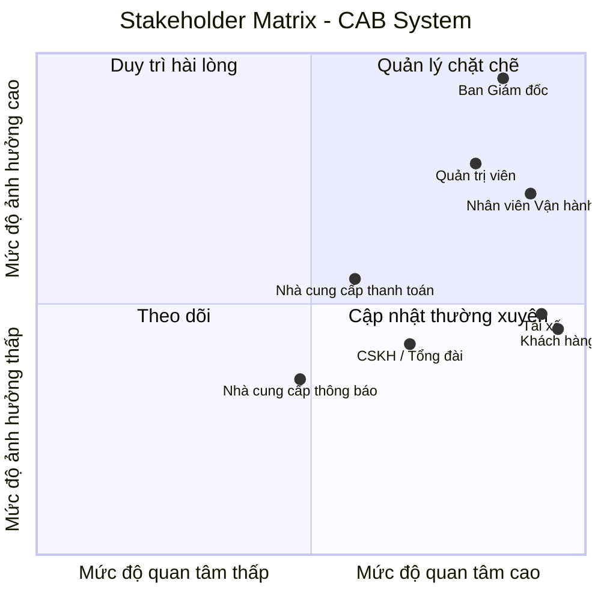
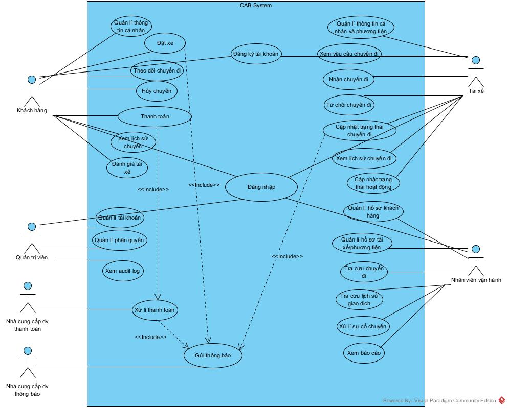

# 23646721_NguyenThiHong_cabsystem
# CAB System – Nền tảng đặt xe trực tuyến
## B1: TỔNG QUAN VỀ HỆ THỐNG
### 1. Giới thiệu
CAB System là nền tảng đặt xe trực tuyến được xây dựng cho Công ty ABC nhằm thay thế và cải tiến mô hình vận hành hiện tại dựa trên tổng đài và ứng dụng đơn giản. Hệ thống hướng đến việc số hóa toàn bộ quy trình đặt xe, từ tiếp nhận yêu cầu, tìm và phân công tài xế, thực hiện chuyến đi, tính cước, thanh toán, thông báo đến đánh giá sau chuyến.

Mục tiêu của dự án không chỉ là xây dựng một ứng dụng đặt xe mà còn tạo ra một nền tảng có khả năng mở rộng lâu dài, phục vụ ba nhóm người dùng chính: khách hàng, tài xế và nhân viên vận hành.
 
### 2. Khó khăn của phương pháp/hệ thống hiện tại

Hệ thống hiện tại của Công ty ABC (tổng đài + app đơn giản) đang gặp phải các hạn chế sau:

| Vấn đề | Mô tả |
|---|---|
| **Phân công tài xế thủ công** | Việc ghép tài xế với khách hàng chủ yếu do con người xử lý, tốn thời gian, dễ sai sót, không tối ưu theo vị trí thực tế và không thể mở rộng khi lượng đơn tăng cao. |
| **Thiếu khả năng theo dõi trạng thái chuyến đi** | Khách hàng không biết hệ thống đang tìm tài xế, tài xế nào đã nhận chuyến, thời gian dự kiến đến hay trạng thái hiện tại — gây trải nghiệm mờ mịt, thiếu tin tưởng. |
| **Thông tin thanh toán phân tán** | Dữ liệu thanh toán chưa được quản lý tập trung, gây khó khăn cho việc đối soát, báo cáo doanh thu và xử lý sự cố giao dịch. |
| **Khó mở rộng hệ thống** | Kiến trúc hiện tại không hỗ trợ tốt việc bổ sung dịch vụ mới, phương thức thanh toán mới hay kênh thông báo mới mà không ảnh hưởng đến toàn bộ hệ thống. |
| **Rủi ro vận hành khi tải cao** | Một lỗi nhỏ (ví dụ ở chức năng thanh toán hoặc thông báo) có thể làm ngưng trệ toàn bộ hoạt động đặt xe, vì các thành phần không tách biệt và không thể scale độc lập. |
| **Thiếu công cụ quản trị & báo cáo tập trung** | Nhân viên vận hành khó theo dõi chuyến đang diễn ra, khó tra cứu lịch sử, và ban lãnh đạo thiếu dữ liệu tổng hợp về số chuyến, doanh thu, tỷ lệ hoàn thành/hủy, hiệu quả tài xế. |
| **Bảo mật & kiểm soát truy cập hạn chế** | Chưa có cơ chế xác thực, phân quyền và lưu vết thao tác rõ ràng cho dữ liệu nhạy cảm (cá nhân, vị trí, giao dịch). |

### 3. Giải pháp mà CAB mang lại
- Tự động hóa phân công tài xế: Thay thế việc ghép chuyến thủ công bằng cơ chế tìm và đề xuất tài xế phù hợp dựa trên vị trí và trạng thái sẵn sàng.
- Tăng khả năng theo dõi chuyến đi: Khách hàng có thể biết trạng thái chuyến, tài xế được phân công và thời gian dự kiến tài xế đến.
- Quản lý tập trung chuyến đi và thanh toán: Hỗ trợ lưu trữ, tra cứu lịch sử chuyến, tính cước và theo dõi trạng thái thanh toán trên cùng hệ thống.
- Hỗ trợ vận hành và báo cáo: Nhân viên có thể theo dõi tài xế, chuyến đi, giao dịch và các chỉ số hoạt động để xử lý sự cố và ra quyết định.
- Tăng khả năng mở rộng và chịu lỗi: Các chức năng có thể được phát triển, triển khai và mở rộng độc lập, hạn chế việc lỗi ở một thành phần ảnh hưởng đến toàn hệ thống.
- Tăng cường bảo mật: Áp dụng xác thực, phân quyền, bảo vệ dữ liệu nhạy cảm và lưu vết các thao tác quan trọng.
- Dễ mở rộng trong tương lai: Có thể bổ sung loại dịch vụ, phương thức thanh toán hoặc kênh thông báo mới mà không phải xây dựng lại toàn bộ hệ thống.

---

## B2: XÁC ĐỊNH CÁC BÊN LIÊN QUAN TRONG HỆ THỐNG

| **Stakeholder**                                | **Vai trò**                                                                                                                                         |
| ---------------------------------------------- | --------------------------------------------------------------------------------------------------------------------------------------------------------- |
| **Ban Giám đốc**                               | Nhà tài trợ dự án (Sponsor); định hướng chiến lược, phê duyệt phạm vi và theo dõi hiệu quả vận hành, doanh thu.                                           |
| **Khách hàng**                                 | Người dùng đầu cuối; tạo yêu cầu đặt xe, theo dõi trạng thái chuyến đi và ETA, thanh toán và đánh giá tài xế sau chuyến.                                  |
| **Tài xế**                                     | Người dùng đầu cuối; quản lý hồ sơ/phương tiện, cập nhật vị trí và trạng thái hoạt động, nhận/từ chối chuyến và cập nhật tiến trình chuyến đi.            |
| **Nhân viên Vận hành**                         | Người dùng nội bộ; quản lý khách hàng, tài xế, phương tiện và chuyến đi; theo dõi các chuyến đang diễn ra và hỗ trợ xử lý sự cố.                          |
| **Quản trị viên** |  Thực hiện các thao tác quản trị nhạy cảm và quản lý quyền truy cập.                                                             |
| **Nhà cung cấp dịch vụ thanh toán**            | Hệ thống/đối tác bên ngoài; xử lý thanh toán điện tử mà không yêu cầu CAB lưu trực tiếp thông tin thanh toán nhạy cảm.                                    |
| **Nhà cung cấp dịch vụ thông báo**             | Hỗ trợ gửi thông báo đến người dùng và cho phép mở rộng thêm các kênh thông báo trong tương lai.                                             |
| **Bộ phận CSKH / Tổng đài**                    | Hỗ trợ khách hàng khi phát sinh vấn đề liên quan đến đặt xe, chuyến đi hoặc thanh toán; tra cứu thông tin cần thiết để tiếp nhận và xử lý yêu cầu hỗ trợ. |

## Stakeholder matrix

---

## B3: XÁC ĐỊNH MỤC TIÊU DOANH NGHIỆP (Business Goal) 
| Stt | Mục tiêu                                              | Diễn giải                                                                                                                  |
| - | ----------------------------------------------------------- | -------------------------------------------------------------------------------------------------------------------------- |
| 1 | **Tăng hiệu quả vận hành, giảm phụ thuộc xử lý thủ công**   | Tự động hóa việc tìm và phân công tài xế, giảm thời gian xử lý và sai sót do con người.                                    |
| 2 | **Nâng cao trải nghiệm và sự tin tưởng của khách hàng**     | Cho phép khách hàng theo dõi trạng thái chuyến đi, tài xế được phân công, ETA và chi phí một cách minh bạch.               |
| 3 | **Tập trung hóa và kiểm soát dữ liệu thanh toán**           | Quản lý tập trung thông tin thanh toán và giao dịch, hỗ trợ tra cứu và báo cáo doanh thu.                                  |
| 4 | **Mở rộng quy mô kinh doanh**                               | Hệ thống có khả năng phục vụ số lượng lớn khách hàng và tài xế, đặc biệt trong các thời điểm nhu cầu tăng cao.             |
| 5 | **Tăng khả năng mở rộng và thích ứng lâu dài của sản phẩm** | Dễ dàng bổ sung dịch vụ mới, phương thức thanh toán mới và kênh thông báo mới mà không phải xây dựng lại toàn bộ hệ thống. |
| 6 | **Đảm bảo tính liên tục và ổn định của dịch vụ**            | Sự cố ở một chức năng như thanh toán hoặc thông báo không được làm ngưng trệ toàn bộ quy trình đặt xe.                     |
| 7 | **Cải thiện năng lực ra quyết định dựa trên dữ liệu**       | Cung cấp báo cáo về số chuyến, doanh thu, tỷ lệ hoàn thành, tỷ lệ hủy và hiệu quả hoạt động của tài xế.                    |
| 8 | **Tăng cường bảo mật và kiểm soát dữ liệu**                 | Bảo vệ dữ liệu cá nhân, phương tiện, vị trí và giao dịch; kiểm soát quyền truy cập và lưu vết các thao tác quan trọng.     |

 ---
 ## B4: XÁC ĐỊNH PHẠM VI DỰ ÁN (7 TUẦN)
 ### Các Module của hệ thống 

| Tên Module                                                                | Mô tả                                                                                                                                                                      |
| ------------------------------------------------------------------------- | -------------------------------------------------------------------------------------------------------------------------------------------------------------------------- |
| **1. Authentication & Authorization (Chứng thực, Xác thực & Phân quyền)** | Quản lý đăng ký, đăng nhập, xác thực danh tính người dùng, token/session và kiểm soát quyền truy cập theo vai trò Khách hàng, Tài xế, Nhân viên vận hành và Quản trị viên. |
| **2. Customer Management (Quản lý Khách hàng)**                           | Quản lý hồ sơ và thông tin cá nhân của khách hàng; hỗ trợ xem lịch sử chuyến đi và đánh giá tài xế sau chuyến.                                                             |
| **3. Driver & Vehicle Management (Quản lý Tài xế & Phương tiện)**         | Quản lý hồ sơ tài xế, thông tin phương tiện, trạng thái làm việc, trạng thái sẵn sàng nhận chuyến và vị trí tài xế.                                                        |
| **4. Booking & Trip Management (Đặt xe & Quản lý Chuyến đi)**             | Tiếp nhận yêu cầu đặt xe, quản lý điểm đón/điểm đến, loại xe, hủy chuyến và toàn bộ trạng thái trong vòng đời chuyến đi.                                                   |
| **5. Driver Matching & Dispatch (Tìm kiếm & Điều phối Tài xế)**           | Tìm tài xế phù hợp dựa trên vị trí và trạng thái sẵn sàng; gửi yêu cầu nhận chuyến và xử lý chấp nhận, từ chối, timeout hoặc không tìm được tài xế.                        |
| **6. Fare & Payment Management (Tính cước & Quản lý Thanh toán)**         | Tính cước sau khi chuyến hoàn thành; hỗ trợ tiền mặt và thanh toán điện tử; xử lý trạng thái thanh toán thành công, thất bại và retry.                                     |
| **7. Notification Management (Quản lý Thông báo)**                        | Gửi thông báo cho khách hàng và tài xế tại các sự kiện quan trọng như tiếp nhận yêu cầu, phân công tài xế, tài xế đến, hoàn thành chuyến và kết quả thanh toán.            |
| **8. Operations & Reporting (Quản lý Vận hành & Báo cáo)**                | Hỗ trợ nhân viên vận hành quản lý khách hàng, tài xế, phương tiện và chuyến đi; xử lý sự cố, tra cứu giao dịch và xem các báo cáo hoạt động cơ bản.                        |

 ---
 
## B5: XÁC ĐỊNH CÁC YÊU CẦU NGHIỆP VỤ (Business Requirements)

| Module | Business Requirements |
|---|---|
| **1. Authentication & Authorization (Xác thực & Phân quyền)** | • Cho phép khách hàng và tài xế đăng ký, đăng nhập và quản lý tài khoản. • Xác thực người dùng trước khi sử dụng các chức năng yêu cầu tài khoản. • Phân quyền theo vai trò: Khách hàng, Tài xế, Nhân viên vận hành và Quản trị viên. • Các thao tác quản trị nhạy cảm chỉ được thực hiện bởi người có quyền phù hợp. |
| **2. Customer Management (Quản lý Khách hàng)** | • Cho phép khách hàng xem và cập nhật thông tin cá nhân. • Cho phép khách hàng xem lịch sử và thông tin chuyến đi. • Cho phép khách hàng đánh giá tài xế sau khi chuyến đi hoàn thành. |
| **3. Driver & Vehicle Management (Quản lý Tài xế & Phương tiện)** | • Quản lý hồ sơ tài xế và thông tin phương tiện. • Cho phép tài xế cập nhật trạng thái sẵn sàng hoặc không sẵn sàng nhận chuyến. • Ghi nhận vị trí tài xế để hỗ trợ tìm tài xế phù hợp và ước tính ETA. |
| **4. Booking & Trip Management (Đặt xe & Quản lý Chuyến đi)** | • Cho phép khách hàng tạo yêu cầu đặt xe với điểm đón, điểm đến và loại xe. • Quản lý trạng thái chuyến đi từ khi tạo đến khi hoàn thành hoặc hủy. • Cho phép khách hàng theo dõi trạng thái chuyến, tài xế được phân công và ETA. • Cho phép tài xế cập nhật các trạng thái chính của chuyến đi. |
| **5. Driver Matching & Dispatch (Tìm kiếm & Điều phối Tài xế)** | • Tự động tìm tài xế phù hợp dựa trên vị trí và trạng thái sẵn sàng. • Cho phép tài xế chấp nhận hoặc từ chối yêu cầu nhận chuyến. • Nếu tài xế từ chối hoặc không phản hồi, hệ thống tiếp tục tìm tài xế khác mà khách hàng không cần đặt lại. • Thông báo cho khách hàng khi không tìm được tài xế phù hợp. |
| **6. Fare & Payment Management (Tính cước & Thanh toán)** | • Tính số tiền khách hàng phải trả sau khi chuyến đi hoàn thành. • Hỗ trợ thanh toán bằng tiền mặt và thanh toán điện tử qua nhà cung cấp bên ngoài. • Không lưu trực tiếp thông tin thanh toán nhạy cảm của khách hàng. • Thông báo và cho phép xử lý lại khi thanh toán điện tử thất bại. |
| **7. Notification Management (Quản lý Thông báo)** | • Thông báo cho khách hàng tại các mốc quan trọng của chuyến đi và thanh toán. • Thông báo cho tài xế khi có chuyến mới hoặc thay đổi liên quan đến chuyến đang thực hiện. • Cho phép mở rộng thêm kênh hoặc nhà cung cấp thông báo trong tương lai. |
| **8. Operations & Reporting (Quản lý Vận hành & Báo cáo)** | • Cho phép nhân viên vận hành quản lý và tra cứu khách hàng, tài xế, phương tiện và chuyến đi. • Theo dõi các chuyến đang diễn ra và hỗ trợ xử lý các trường hợp gặp sự cố. • Cung cấp báo cáo cơ bản về số chuyến, doanh thu, tỷ lệ hoàn thành/hủy và hiệu quả tài xế. • Lưu vết các thao tác quan trọng để phục vụ kiểm tra khi xảy ra sự cố. |

 ---

## B6: PHÂN RÃ CÁC YÊU CẦU CHỨC NĂNG (Functional Requirements)

**1. Authentication & Authorization – Xác thực & Phân quyền**
- **Đăng ký tài khoản**: Cho phép khách hàng và tài xế tạo tài khoản.
- **Đăng nhập**: Xác thực thông tin và cho phép người dùng truy cập hệ thống.
- **Phân quyền**: Giới hạn chức năng theo Customer, Driver, Operations/Admin.

**2. Customer Management – Quản lý Khách hàng**
- **Quản lý hồ sơ**: Xem và cập nhật thông tin cá nhân.
- **Xem lịch sử chuyến**: Tra cứu các chuyến đã thực hiện.
- **Đánh giá tài xế**: Đánh giá tài xế sau khi chuyến hoàn thành.

**3. Driver & Vehicle Management – Quản lý Tài xế & Phương tiện**
- **Quản lý hồ sơ và phương tiện**: Xem/cập nhật thông tin tài xế và xe.
- **Cập nhật trạng thái hoạt động**: Chuyển trạng thái sẵn sàng hoặc không sẵn sàng nhận chuyến.
- **Cập nhật vị trí**: Gửi vị trí hiện tại phục vụ tìm tài xế và ETA.

**4. Booking & Trip Management – Đặt xe & Quản lý Chuyến đi**
- **Tạo yêu cầu đặt xe**: Nhập điểm đón, điểm đến và loại xe.
- **Theo dõi chuyến**: Xem trạng thái, tài xế được phân công và ETA.
- **Cập nhật trạng thái chuyến**: Tài xế cập nhật đã đến, đón khách, đang di chuyển và hoàn thành.
- **Hủy chuyến**: Cho phép hủy chuyến theo chính sách MVP.

**5. Driver Matching & Dispatch – Tìm kiếm & Điều phối Tài xế**
- **Tìm tài xế phù hợp**: Lọc theo trạng thái, loại xe và vị trí.
- **Ưu tiên tài xế gần**: Xếp thứ tự các tài xế phù hợp.
- **Gửi yêu cầu nhận chuyến**: Gửi ride offer đến tài xế được chọn.
- **Chấp nhận/Từ chối chuyến**: Cho phép tài xế phản hồi yêu cầu.
- **Xử lý từ chối/timeout**: Tự động tìm tài xế tiếp theo; thông báo nếu không còn tài xế phù hợp.

**6. Fare & Payment Management – Tính cước & Thanh toán**
- **Tính cước**: Tính số tiền sau khi chuyến hoàn thành.
- **Chọn phương thức thanh toán**: Hỗ trợ tiền mặt hoặc điện tử.
- **Xử lý thanh toán**: Ghi nhận tiền mặt hoặc gửi giao dịch đến payment provider.
- **Xử lý kết quả thanh toán**: Ghi nhận thành công/thất bại và cho phép retry khi thất bại.

**7. Notification Management – Quản lý Thông báo**
- **Thông báo cho khách hàng**: Thông báo các mốc chính như tiếp nhận booking, có tài xế, tài xế đến, hoàn thành và thanh toán.
- **Thông báo cho tài xế**: Thông báo chuyến mới và các thay đổi liên quan đến chuyến.

**8. Operations & Reporting – Vận hành & Báo cáo**
- **Tra cứu dữ liệu vận hành**: Xem khách hàng, tài xế, phương tiện và chuyến đi.
- **Theo dõi chuyến đang diễn ra**: Kiểm tra trạng thái chuyến và tài xế.
- **Tra cứu giao dịch**: Xem thông tin và trạng thái thanh toán.
- **Báo cáo cơ bản**: Thống kê số chuyến, hoàn thành/hủy và doanh thu.

 ---
## B7: USECASE DIAGRAM

---
## B8: ĐẶC TẢ USECASE
### Đặc tả UseCase Đặt xe
| | |
| :--- | :--- |
| **Tên use case:** | **Đặt xe** |
| **Actor:** | Khách hàng |
| **Mô tả:** | Cho phép khách hàng tạo yêu cầu chuyến đi bằng cách nhập điểm đón, điểm đến và loại xe; hệ thống sau đó tự động tìm tài xế phù hợp. |
| **Tiền điều kiện (Precondition):** | Khách hàng đã đăng nhập và đang không thực hiện chuyến xe nào. |
| **Hậu điều kiện (Postcondition):** | Yêu cầu đặt xe được tạo và tài xế phù hợp được phân công. |
| **Luồng sự kiện chính (Basic flow)** | |
| **Actor: Người dùng** | **Hệ thống** |
| 1. Chọn chức năng Đặt xe. | 2. Hiển thị giao diện đặt xe. |
| 3. Nhập điểm đón và điểm đến. | 4. Kiểm tra địa điểm chuyến đi. |
| | 5. Hiển thị khoảng cách và giá tiền ứng với từng loại phương tiện. |
| 6. Chọn loại xe mong muốn và chọn phương thức thanh toán mặc định (Tiền mặt). | |
| 7. Nhấn tìm chuyến. | 8. Tạo yêu cầu chuyến và hiển thị trạng thái đang tìm tài xế. |
| | 9. Hiển thị thông báo đã tìm thấy tài xế. |
| | 10. Cập nhật trạng thái chuyến và thông báo thông tin tài xế cho khách hàng. |
| **Luồng sự kiện thay thế (Alternate flow)** | |
| | 4.1 Nếu thông tin địa chỉ không hợp lệ, hiển thị thông báo "Không tìm thấy vị trí" và yêu cầu khách hàng nhập lại thông tin. |
| 6.1 Khách hàng chọn phương thức thanh toán là Ví điện tử/Thẻ ngân hàng. | 6.2 Ghi nhận phương thức thanh toán |
| | 6.3 Quay lại bước 7. |
| | 8.1 Nếu không tìm thấy tài xế trong thời gian quy định (Timeout), hiển thị thông báo "Không tìm thấy tài xế cho chuyến đi này, vui lòng thử lại sau". |
| 8.2 Nhấn Đồng ý. | 8.3 Quay về bước 2. |

### Đặc tả UseCase Nhận chuyến đi
| | |
| :--- | :--- |
| **Tên use case:** | **Nhận chuyến đi** |
| **Actor:** | Tài xế |
| **Mô tả:** | Tài xế nhận được yêu cầu điều phối chuyến đi từ hệ thống và thao tác chấp nhận để bắt đầu phục vụ khách hàng. |
| **Tiền điều kiện (Precondition):** | Tài xế đã đăng nhập, đang bật trạng thái "Sẵn sàng nhận chuyến" và nằm trong bán kính quét của hệ thống. |
| **Hậu điều kiện (Postcondition):** | Chuyến đi được gán chính thức cho tài xế; hệ thống ngừng phát yêu cầu cho tài xế khác. |
| **Luồng sự kiện chính (Basic flow)** | |
| **Actor: Người dùng** | **Hệ thống** |
| | 1. Hiển thị thông báo yêu cầu nhận chuyến trên màn hình tài xế (gồm: khoảng cách, điểm đón, điểm đến, giá cước) kèm đồng hồ đếm ngược. |
| 2. Nhấn nút "Chấp nhận" trong khoảng thời gian quy định. | 3. Ghi nhận tài xế cho chuyến đi và ngừng gửi yêu cầu này cho các tài xế khác. |
| | 4. Cập nhật trạng thái chuyến thành "Tài xế đang đến". |
| | 5. Mở màn hình bản đồ điều hướng cho tài xế đi đến điểm đón. |
| **Luồng sự kiện thay thế (Alternate flow)** | |
| 2.1 Nhấn nút "Từ chối" hoặc bỏ qua để hết thời gian nhận chuyến. | 2.2 Thu hồi yêu cầu trên thiết bị tài xế hiện tại. |
| | 2.3 Tự động chuyển yêu cầu tìm chuyến cho tài xế phù hợp tiếp theo.|

### Đặc tả UseCase Cập nhật trạng thái chuyến đi
| | |
| :--- | :--- |
| **Tên use case:** | **Cập nhật trạng thái chuyến đi** |
| **Actor:** | Tài xế |
| **Mô tả:** | Tài xế thao tác trên ứng dụng để cập nhật tiến độ của chuyến đi theo thời gian thực (đã đến, đang chạy, hoàn thành). |
| **Tiền điều kiện (Precondition):** | Tài xế đã nhận chuyến thành công và đang trên đường đến điểm đón. |
| **Hậu điều kiện (Postcondition):** | Chuyến đi kết thúc, hệ thống chốt số tiền cước phí cuối cùng và chuyển sang luồng thanh toán. |
| **Luồng sự kiện chính (Basic flow)** | |
| **Actor: Người dùng** | **Hệ thống** |
| 1. Nhấn nút "Đã đến điểm đón" khi tới nơi. | 2. Ghi nhận thời gian và gửi thông báo "Tài xế đã đến" cho khách hàng. |
| 3. Nhấn nút "Bắt đầu chuyến" sau khi khách hàng lên xe. | 4. Cập nhật trạng thái chuyến thành "Đang di chuyển" và bắt đầu ghi nhận lộ trình thực tế. |
| 5. Nhấn nút "Hoàn thành chuyến" khi đến điểm đích. | 6. Ghi nhận chuyến đi kết thúc, chốt số tiền cước phí cuối cùng và hiển thị hóa đơn tổng hợp. |
| **Luồng sự kiện thay thế (Alternate flow)** | |
|  |  |

### Đặc tả UseCase Hủy chuyến
| | |
| :--- | :--- |
| **Tên use case:** | **Hủy chuyến** |
| **Actor:** | Khách hàng, Tài xế |
| **Mô tả:** | Người dùng thao tác hủy yêu cầu đặt xe khi chuyến đi chưa bắt đầu di chuyển. |
| **Tiền điều kiện (Precondition):** | Chuyến đi đang ở trạng thái chờ tài xế hoặc "Tài xế đang đến" (chưa bấm Bắt đầu chuyến). |
| **Hậu điều kiện (Postcondition):** | Chuyến đi bị hủy bỏ, hệ thống giải phóng tài xế để nhận cuốc mới. |
| **Luồng sự kiện chính (Basic flow)** | |
| **Actor: Người dùng** | **Hệ thống** |
| 1. Chọn chức năng "Hủy chuyến". | 2. Hiển thị danh sách các lý do hủy chuyến và yêu cầu xác nhận. |
| 3. Chọn lý do hủy và nhấn nút "Xác nhận". | 4. Cập nhật trạng thái chuyến thành "Đã hủy" và lưu lý do vào cơ sở dữ liệu. |
| | 5. Gửi thông báo hủy chuyến cho bên còn lại (nếu đã có tài xế nhận chuyến). |
| | 6. Đặt lại trạng thái tài xế thành "Sẵn sàng". |
| **Luồng sự kiện thay thế (Alternate flow)** | |
| | |

### Đặc tả UseCase Thanh toán
| | |
| :--- | :--- |
| **Tên use case:** | **Thanh toán chuyến đi** |
| **Actor:** | Khách hàng (vai trò tiếp nhận), Hệ thống |
| **Mô tả:** | Hệ thống tự động xử lý thanh toán cước phí sau khi chuyến đi hoàn thành dựa trên phương thức khách hàng đã chọn. |
| **Tiền điều kiện (Precondition):** | Chuyến đi đã được tài xế cập nhật trạng thái là "Hoàn thành". Hệ thống đã chốt số tiền cước phí cuối cùng. |
| **Hậu điều kiện (Postcondition):** | Giao dịch được ghi nhận thành công, chuyến đi đóng lại và chuyển sang luồng đánh giá dịch vụ. |
| **Luồng sự kiện chính (Basic flow)** | |
| **Actor: Người dùng** | **Hệ thống** |
| | 1. Ghi nhận trạng thái hoàn thành và kiểm tra phương thức thanh toán mặc định (Ví điện tử/Thẻ). |
| | 2. Tự động gửi request trừ tiền (chứa số tiền và mã giao dịch) đến Cổng thanh toán (Payment Gateway). |
| | 3. Nhận phản hồi "Thành công" từ Cổng thanh toán. |
| | 4. Cập nhật trạng thái chuyến đi thành "Đã thanh toán". |
| 5. Xem hóa đơn điện tử tự động hiển thị và chuyển sang màn hình Đánh giá tài xế. | |
| **Luồng sự kiện thay thế (Alternate flow)** | |
| 1.1 Phương thức thanh toán được thiết lập là "Tiền mặt". | 1.2 Hiển thị thông báo cho khách hàng: "Vui lòng thanh toán số tiền X cho tài xế". |
| | 1.3 Hiển thị nút "Xác nhận đã thu đủ tiền" trên màn hình của tài xế. |
| 1.4 Tài xế nhấn nút "Xác nhận đã thu đủ tiền". | 1.5 Cập nhật trạng thái chuyến đi thành "Đã thanh toán" và kết thúc luồng. |
| | 2.1 Cổng thanh toán phản hồi "Thất bại" (do thẻ lỗi, số dư không đủ...). |
| | 2.2 Hiển thị thông báo lỗi thanh toán trên máy khách hàng, yêu cầu nạp thêm tiền, chọn thẻ khác hoặc chuyển sang trả Tiền mặt. |
| 2.3 Khách hàng chọn phương thức mới và bấm nút "Thanh toán" thủ công. | 2.4 Thực hiện lại luồng gửi request giao dịch ở bước 2. |

---
## B9: PHÂN TÍCH QUY TRÌNH NGHIỆP VỤ (Business Process)
### 1. Quy trình Đặt xe và Điều phối
Khách hàng nhập điểm đón, điểm đến và loại xe -> Hệ thống tính toán cước phí dự kiến -> Khách hàng bấm "Đặt xe" -> Hệ thống quét và lọc danh sách tài xế khả dụng (dựa trên vị trí và trạng thái) -> Hệ thống gửi yêu cầu nhận chuyến (Ride Offer) cho tài xế phù hợp nhất kèm đếm ngược thời gian -> Tài xế bấm "Chấp nhận" -> Hệ thống gán chuyến đi cho tài xế -> Hệ thống thông báo thông tin xe và ETA cho Khách hàng -> Chuyển sang Quy trình Thực hiện chuyến đi.

### 2. Quy trình Thực hiện chuyến đi
Tài xế di chuyển theo bản đồ đến điểm đón -> Tài xế đến nơi, bấm "Đã đến điểm đón" -> Hệ thống thông báo cho Khách hàng ra xe -> Khách hàng lên xe -> Tài xế bấm "Bắt đầu chuyến" -> Hệ thống cập nhật trạng thái "Đang di chuyển" và khóa chức năng hủy chuyến -> Tài xế lái xe đến điểm đích -> Tài xế bấm "Hoàn thành chuyến" -> Hệ thống chốt số tiền cước phí cuối cùng -> Chuyển sang Quy trình Thanh toán.

### 3. Quy trình Thanh toán và Đánh giá

**Thanh toán điện tử:**
Chuyến đi hoàn thành -> Hệ thống kiểm tra phương thức thanh toán là Ví điện tử/Thẻ -> Hệ thống tự động gửi API trừ tiền đến Cổng thanh toán -> Cổng thanh toán trả về kết quả "Thành công" -> Hệ thống đóng giao dịch và hiển thị hóa đơn -> Hệ thống mở màn hình Đánh giá -> Khách hàng chọn số sao và gửi đánh giá -> Hệ thống lưu dữ liệu -> Hoàn tất vòng đời chuyến đi.

**Thanh toán Tiền mặt:** 
Hệ thống kiểm tra phương thức là Tiền mặt -> Hiển thị số tiền cần thu trên máy Tài xế -> Tài xế thu tiền và bấm "Đã thu đủ" -> Hệ thống đóng giao dịch -> Chuyển sang bước Đánh giá.

---
## B10: CÁC QUY TẮC NGHIỆP VỤ

| Nhóm Quy tắc | Tên Quy tắc Nghiệp vụ | Nội dung |
| :--- | :--- | :--- |
| **Driver & Vehicle Management** | **Điều kiện nhận chuyến** | Tài xế chỉ được hệ thống đưa vào danh sách phân bổ chuyến đi khi thỏa mãn 2 điều kiện: đang bật trạng thái "Sẵn sàng" và hiện không có cuốc xe nào đang thực hiện. |
| **Booking & Trip Management** | **Giới hạn chuyến đi đồng thời** | Mỗi khách hàng chỉ được phép tạo và duy trì tối đa **01 chuyến đi** đang ở trạng thái kích hoạt (từ lúc đặt đến lúc hoàn thành/hủy) tại một thời điểm. |
| **Booking & Trip Management** | **Chính sách hủy chuyến** | Khách hàng/Tài xế chỉ được phép hủy khi chuyến ở trạng thái "Đang tìm tài xế" hoặc "Tài xế đang đến". Chức năng hủy bị vô hiệu hóa khi "Bắt đầu chuyến". |
| **Driver Matching & Dispatch** | **Bán kính quét & Timeout** | Hệ thống quét tìm tài xế khả dụng trong bán kính tối đa **5km** tính từ điểm đón. Khi nhận yêu cầu, tài xế có **60 giây** để phản hồi. Nếu từ chối hoặc hết giờ (timeout), hệ thống tự động chuyển yêu cầu cho tài xế gần tiếp theo. |
| **Fare & Payment Management** | **Cơ sở tính cước (MVP)** | Giá cước được **tính và chốt cố định ngay tại thời điểm đặt xe** (dựa trên khoảng cách ước tính và đơn giá của loại xe). |
| **Fare & Payment Management** | **Xử lý giao dịch thất bại** | Nếu thanh toán qua cổng điện tử thất bại (thẻ lỗi, hết tiền), hệ thống chặn việc đóng chuyến và yêu cầu khách hàng **đổi sang phương thức Tiền mặt** (hoặc thử lại thẻ khác) để kết thúc giao dịch. |

--- 
## B11: ACCEPTANCE CRITERIA

Acceptance Criteria được xác định dựa trên Business Requirements, Functional Requirements, Use Case, Business Process và Business Rules của CAB System.

### 1. Authentication & Authorization – Xác thực & Phân quyền

| ID             | Acceptance Criteria                                                                                                                                                                          |
| -------------- | -------------------------------------------------------------------------------------------------------------------------------------------------------------------------------------------- |
| **AC-AUTH-01** | **Given** người dùng chưa có tài khoản và thuộc vai trò Customer hoặc Driver, **When** thực hiện đăng ký với thông tin hợp lệ, **Then** hệ thống tạo tài khoản thành công.                   |
| **AC-AUTH-02** | **Given** người dùng đã có tài khoản, **When** nhập thông tin đăng nhập hợp lệ, **Then** hệ thống xác thực thành công và cho phép truy cập hệ thống.                                         |
| **AC-AUTH-03** | **Given** người dùng chưa được xác thực, **When** truy cập chức năng yêu cầu đăng nhập, **Then** hệ thống từ chối truy cập.                                                                  |
| **AC-AUTH-04** | **Given** người dùng đã đăng nhập, **When** truy cập một chức năng trong hệ thống, **Then** hệ thống chỉ cho phép các chức năng phù hợp với vai trò Customer, Driver, Operations hoặc Admin. |
| **AC-AUTH-05** | **Given** người dùng không có quyền quản trị phù hợp, **When** thực hiện thao tác quản trị nhạy cảm, **Then** hệ thống từ chối thao tác.                                                     |

---

### 2. Customer Management – Quản lý Khách hàng

| ID            | Acceptance Criteria                                                                                                                               |
| ------------- | ------------------------------------------------------------------------------------------------------------------------------------------------- |
| **AC-CUS-01** | **Given** Customer đã đăng nhập, **When** mở hồ sơ cá nhân, **Then** hệ thống hiển thị thông tin hồ sơ của Customer.                              |
| **AC-CUS-02** | **Given** Customer đã đăng nhập, **When** cập nhật thông tin cá nhân hợp lệ, **Then** hệ thống lưu thông tin mới và hiển thị dữ liệu đã cập nhật. |
| **AC-CUS-03** | **Given** Customer có lịch sử chuyến đi, **When** yêu cầu xem lịch sử chuyến, **Then** hệ thống hiển thị danh sách các chuyến của Customer.       |
| **AC-CUS-04** | **Given** chuyến đi đã hoàn thành, **When** Customer gửi đánh giá tài xế, **Then** hệ thống ghi nhận đánh giá cho tài xế của chuyến đi tương ứng. |
| **AC-CUS-05** | **Given** chuyến đi chưa hoàn thành, **When** Customer cố gửi đánh giá tài xế, **Then** hệ thống không cho phép đánh giá.                         |

---

### 3. Driver & Vehicle Management – Quản lý Tài xế & Phương tiện

| ID            | Acceptance Criteria                                                                                                                                                          |
| ------------- | ---------------------------------------------------------------------------------------------------------------------------------------------------------------------------- |
| **AC-DRV-01** | **Given** Driver đã đăng nhập, **When** xem hồ sơ, **Then** hệ thống hiển thị thông tin tài xế và phương tiện.                                                               |
| **AC-DRV-02** | **Given** Driver đã đăng nhập, **When** cập nhật thông tin hồ sơ hoặc phương tiện hợp lệ, **Then** hệ thống lưu dữ liệu mới.                                                 |
| **AC-DRV-03** | **Given** Driver không có chuyến đang thực hiện, **When** chuyển trạng thái sang `"Sẵn sàng"`, **Then** Driver có thể được đưa vào danh sách tìm kiếm tài xế cho chuyến mới. |
| **AC-DRV-04** | **Given** Driver đang ở trạng thái `"Không sẵn sàng"`, **When** hệ thống tìm tài xế cho booking mới, **Then** Driver không được đưa vào danh sách phân bổ chuyến.            |
| **AC-DRV-05** | **Given** Driver đang sử dụng hệ thống, **When** gửi vị trí hiện tại, **Then** hệ thống ghi nhận vị trí để phục vụ tìm tài xế và tính ETA.                                   |
| **AC-DRV-06** | **Given** Driver đang có một chuyến đang thực hiện, **When** hệ thống tìm tài xế cho booking khác, **Then** Driver không được đưa vào danh sách phân bổ.                     |

---

### 4. Booking & Trip Management – Đặt xe & Quản lý Chuyến đi

#### 4.1. Tạo yêu cầu đặt xe

| ID             | Acceptance Criteria                                                                                                                                                                   |
| -------------- | ------------------------------------------------------------------------------------------------------------------------------------------------------------------------------------- |
| **AC-TRIP-01** | **Given** Customer đã đăng nhập và không có chuyến active, **When** chọn chức năng đặt xe, **Then** hệ thống cho phép Customer tạo booking mới.                                       |
| **AC-TRIP-02** | **Given** Customer nhập điểm đón và điểm đến hợp lệ, **When** hệ thống kiểm tra địa điểm, **Then** hệ thống hiển thị khoảng cách và giá tiền tương ứng với từng loại phương tiện.     |
| **AC-TRIP-03** | **Given** Customer nhập điểm đón hoặc điểm đến không hợp lệ, **When** hệ thống kiểm tra địa điểm, **Then** hệ thống hiển thị thông báo `"Không tìm thấy vị trí"` và yêu cầu nhập lại. |
| **AC-TRIP-04** | **Given** Customer đã nhập điểm đón, điểm đến và chọn loại xe, **When** nhấn `"Tìm chuyến"`, **Then** hệ thống tạo yêu cầu chuyến và chuyển sang trạng thái `"Đang tìm tài xế"`.      |
| **AC-TRIP-05** | **Given** Customer đang có một chuyến active, **When** cố tạo thêm booking mới, **Then** hệ thống từ chối yêu cầu.                                                                    |
| **AC-TRIP-06** | **Given** Customer chưa chọn phương thức thanh toán khác, **When** tạo booking, **Then** phương thức thanh toán mặc định là `"Tiền mặt"`.                                             |
| **AC-TRIP-07** | **Given** Customer chọn Ví điện tử hoặc Thẻ ngân hàng, **When** tiếp tục quá trình booking, **Then** hệ thống ghi nhận phương thức thanh toán được chọn.                              |

#### 4.2. Theo dõi chuyến đi

| ID             | Acceptance Criteria                                                                                                                                        |
| -------------- | ---------------------------------------------------------------------------------------------------------------------------------------------------------- |
| **AC-TRIP-08** | **Given** booking đang tìm tài xế, **When** Customer xem thông tin chuyến, **Then** hệ thống hiển thị trạng thái hiện tại của chuyến.                      |
| **AC-TRIP-09** | **Given** Driver đã nhận chuyến, **When** Customer xem chuyến, **Then** hệ thống hiển thị thông tin Driver được phân công và ETA.                          |
| **AC-TRIP-10** | **Given** Driver chấp nhận chuyến thành công, **When** hệ thống hoàn tất việc phân công, **Then** trạng thái chuyến được chuyển thành `"Tài xế đang đến"`. |

#### 4.3. Cập nhật trạng thái chuyến đi

| ID             | Acceptance Criteria                                                                                                                                                                |
| -------------- | ---------------------------------------------------------------------------------------------------------------------------------------------------------------------------------- |
| **AC-TRIP-11** | **Given** Driver đã nhận chuyến và đến điểm đón, **When** Driver chọn `"Đã đến điểm đón"`, **Then** hệ thống ghi nhận thời gian và gửi thông báo `"Tài xế đã đến"` cho Customer.   |
| **AC-TRIP-12** | **Given** Driver đã đến điểm đón và Customer đã lên xe, **When** Driver chọn `"Bắt đầu chuyến"`, **Then** hệ thống cập nhật trạng thái chuyến thành `"Đang di chuyển"`.            |
| **AC-TRIP-13** | **Given** chuyến đang ở trạng thái `"Đang di chuyển"`, **When** Driver chọn `"Hoàn thành chuyến"`, **Then** hệ thống ghi nhận chuyến kết thúc và chuyển sang quy trình thanh toán. |

---

### 5. Hủy chuyến

| ID               | Acceptance Criteria                                                                                                                                          |
| ---------------- | ------------------------------------------------------------------------------------------------------------------------------------------------------------ |
| **AC-CANCEL-01** | **Given** chuyến đang ở trạng thái `"Đang tìm tài xế"`, **When** Customer hoặc Driver yêu cầu hủy chuyến, **Then** hệ thống cho phép thực hiện hủy.          |
| **AC-CANCEL-02** | **Given** chuyến đang ở trạng thái `"Tài xế đang đến"`, **When** Customer hoặc Driver yêu cầu hủy chuyến, **Then** hệ thống cho phép thực hiện hủy.          |
| **AC-CANCEL-03** | **Given** chuyến đã ở trạng thái `"Đang di chuyển"`, **When** Customer hoặc Driver cố hủy chuyến, **Then** hệ thống không cho phép hủy.                      |
| **AC-CANCEL-04** | **Given** người dùng chọn chức năng `"Hủy chuyến"`, **When** hệ thống tiếp nhận yêu cầu, **Then** hệ thống hiển thị danh sách lý do hủy và yêu cầu xác nhận. |
| **AC-CANCEL-05** | **Given** người dùng đã chọn lý do hủy, **When** nhấn `"Xác nhận"`, **Then** hệ thống cập nhật chuyến thành `"Đã hủy"` và lưu lý do hủy.                     |
| **AC-CANCEL-06** | **Given** chuyến đã có Driver nhận chuyến, **When** chuyến bị hủy, **Then** hệ thống gửi thông báo hủy cho bên còn lại.                                      |
| **AC-CANCEL-07** | **Given** Driver đang được phân công cho chuyến vừa bị hủy, **When** quá trình hủy hoàn tất, **Then** hệ thống đặt trạng thái Driver trở lại `"Sẵn sàng"`.   |

---

### 6. Driver Matching & Dispatch – Tìm kiếm & Điều phối Tài xế

| ID            | Acceptance Criteria                                                                                                                                                                                          |
| ------------- | ------------------------------------------------------------------------------------------------------------------------------------------------------------------------------------------------------------ |
| **AC-DIS-01** | **Given** có booking đang ở trạng thái `"Đang tìm tài xế"`, **When** hệ thống thực hiện matching, **Then** chỉ các Driver đang `"Sẵn sàng"` và không có chuyến đang thực hiện được xét.                      |
| **AC-DIS-02** | **Given** có nhiều Driver đang sẵn sàng, **When** hệ thống lọc danh sách Driver, **Then** chỉ Driver có loại phương tiện phù hợp với yêu cầu booking được giữ lại.                                           |
| **AC-DIS-03** | **Given** có các Driver phù hợp, **When** hệ thống lọc theo vị trí, **Then** chỉ Driver nằm trong bán kính tối đa **5 km** tính từ điểm đón được xét.                                                        |
| **AC-DIS-04** | **Given** có nhiều Driver đáp ứng điều kiện, **When** hệ thống sắp xếp danh sách Driver, **Then** Driver gần điểm đón hơn được ưu tiên trước.                                                                |
| **AC-DIS-05** | **Given** một Driver được hệ thống lựa chọn, **When** hệ thống gửi Ride Offer, **Then** Driver nhận được thông tin gồm khoảng cách, điểm đón, điểm đến, giá cước và thời gian phản hồi.                      |
| **AC-DIS-06** | **Given** Driver nhận được Ride Offer, **When** Driver chọn `"Chấp nhận"` trong vòng **60 giây**, **Then** hệ thống gán Driver cho chuyến.                                                                   |
| **AC-DIS-07** | **Given** Driver nhận được Ride Offer, **When** Driver chọn `"Từ chối"`, **Then** hệ thống thu hồi Ride Offer và tiếp tục tìm Driver phù hợp tiếp theo.                                                      |
| **AC-DIS-08** | **Given** Driver nhận được Ride Offer, **When** Driver không phản hồi sau **60 giây**, **Then** Ride Offer hết hạn và hệ thống tiếp tục tìm Driver phù hợp tiếp theo.                                        |
| **AC-DIS-09** | **Given** một Driver đã chấp nhận Ride Offer thành công, **When** việc phân công hoàn tất, **Then** hệ thống ngừng gửi yêu cầu của chuyến đó cho Driver khác.                                                |
| **AC-DIS-10** | **Given** không còn Driver phù hợp trong phạm vi tìm kiếm, **When** quá trình matching kết thúc, **Then** hệ thống thông báo cho Customer `"Không tìm thấy tài xế cho chuyến đi này, vui lòng thử lại sau"`. |
| **AC-DIS-11** | **Given** Driver hiện tại từ chối hoặc timeout và vẫn còn Driver phù hợp khác, **When** hệ thống tiếp tục matching, **Then** Customer không cần tạo lại booking.                                             |

---

### 7. Fare & Payment Management – Tính cước & Thanh toán

#### 7.1. Thanh toán Tiền mặt

| ID            | Acceptance Criteria                                                                                                                                                               |
| ------------- | --------------------------------------------------------------------------------------------------------------------------------------------------------------------------------- |
| **AC-PAY-01** | **Given** chuyến đã hoàn thành và phương thức thanh toán là `"Tiền mặt"`, **When** hệ thống bắt đầu xử lý thanh toán, **Then** hệ thống hiển thị số tiền Customer cần thanh toán. |
| **AC-PAY-02** | **Given** phương thức thanh toán là `"Tiền mặt"`, **When** hệ thống hiển thị thông tin thanh toán, **Then** Driver có chức năng `"Xác nhận đã thu đủ tiền"`.                      |
| **AC-PAY-03** | **Given** Driver đã nhận đủ tiền mặt, **When** Driver chọn `"Xác nhận đã thu đủ tiền"`, **Then** hệ thống ghi nhận thanh toán thành công và kết thúc giao dịch.                   |

#### 7.2. Thanh toán điện tử

| ID            | Acceptance Criteria                                                                                                                                                                                            |
| ------------- | -------------------------------------------------------------------------------------------------------------------------------------------------------------------------------------------------------------- |
| **AC-PAY-04** | **Given** chuyến đã hoàn thành và phương thức thanh toán là Ví điện tử hoặc Thẻ, **When** thanh toán được kích hoạt, **Then** hệ thống gửi yêu cầu thanh toán gồm số tiền và mã giao dịch đến Payment Gateway. |
| **AC-PAY-05** | **Given** Payment Gateway xử lý giao dịch, **When** trả về kết quả `"Thành công"`, **Then** hệ thống cập nhật trạng thái thanh toán thành công và chuyến thành `"Đã thanh toán"`.                              |
| **AC-PAY-06** | **Given** thanh toán thành công, **When** giao dịch được hoàn tất, **Then** hệ thống hiển thị hóa đơn và chuyển Customer sang luồng đánh giá Driver.                                                           |
| **AC-PAY-07** | **Given** Payment Gateway xử lý giao dịch, **When** trả về kết quả `"Thất bại"`, **Then** hệ thống ghi nhận thanh toán thất bại và thông báo lỗi cho Customer.                                                 |
| **AC-PAY-08** | **Given** thanh toán điện tử thất bại, **When** Customer xử lý lại thanh toán, **Then** hệ thống cho phép thử lại bằng phương thức điện tử khác hoặc chuyển sang Tiền mặt.                                     |
| **AC-PAY-09** | **Given** thanh toán chưa thành công, **When** hệ thống xử lý kết thúc giao dịch, **Then** hệ thống không được ghi nhận giao dịch là đã hoàn tất.                                                              |
| **AC-PAY-10** | **Given** thanh toán điện tử được thực hiện qua Payment Gateway, **When** hệ thống lưu thông tin giao dịch, **Then** CAB không lưu trực tiếp thông tin thanh toán nhạy cảm của Customer.                       |

---

### 8. Notification Management – Quản lý Thông báo

| ID             | Acceptance Criteria                                                                                                                                           |
| -------------- | ------------------------------------------------------------------------------------------------------------------------------------------------------------- |
| **AC-NOTI-01** | **Given** Customer tạo booking thành công, **When** booking được tiếp nhận, **Then** hệ thống gửi thông báo xác nhận cho Customer.                            |
| **AC-NOTI-02** | **Given** Driver được phân công cho chuyến, **When** quá trình matching thành công, **Then** hệ thống gửi thông tin Driver và trạng thái chuyến cho Customer. |
| **AC-NOTI-03** | **Given** Driver đã đến điểm đón, **When** Driver cập nhật `"Đã đến điểm đón"`, **Then** Customer nhận được thông báo `"Tài xế đã đến"`.                      |
| **AC-NOTI-04** | **Given** chuyến được hoàn thành, **When** trạng thái chuyến được cập nhật, **Then** Customer nhận được thông báo liên quan đến việc hoàn thành chuyến.       |
| **AC-NOTI-05** | **Given** hệ thống nhận được kết quả thanh toán, **When** giao dịch thành công hoặc thất bại, **Then** Customer nhận được thông báo kết quả thanh toán.       |
| **AC-NOTI-06** | **Given** Driver được chọn trong quá trình dispatch, **When** Ride Offer được tạo, **Then** Driver nhận được thông báo chuyến mới.                            |
| **AC-NOTI-07** | **Given** có thay đổi liên quan đến chuyến Driver đang thực hiện, **When** sự kiện xảy ra, **Then** hệ thống gửi thông báo tương ứng cho Driver.              |

---

### 9. Operations & Reporting – Vận hành & Báo cáo

| ID            | Acceptance Criteria                                                                                                                                             |
| ------------- | --------------------------------------------------------------------------------------------------------------------------------------------------------------- |
| **AC-OPS-01** | **Given** Operations có quyền truy cập, **When** tra cứu Customer, **Then** hệ thống hiển thị thông tin Customer được phép xem.                                 |
| **AC-OPS-02** | **Given** Operations có quyền truy cập, **When** tra cứu Driver, **Then** hệ thống hiển thị thông tin Driver.                                                   |
| **AC-OPS-03** | **Given** Operations có quyền truy cập, **When** tra cứu phương tiện, **Then** hệ thống hiển thị thông tin phương tiện.                                         |
| **AC-OPS-04** | **Given** Operations có quyền truy cập, **When** tra cứu chuyến đi, **Then** hệ thống hiển thị thông tin và trạng thái chuyến.                                  |
| **AC-OPS-05** | **Given** có chuyến đang diễn ra, **When** Operations theo dõi chuyến, **Then** hệ thống hiển thị trạng thái chuyến và Driver liên quan.                        |
| **AC-OPS-06** | **Given** có giao dịch thanh toán, **When** Operations tra cứu giao dịch, **Then** hệ thống hiển thị thông tin và trạng thái thanh toán.                        |
| **AC-OPS-07** | **Given** hệ thống có dữ liệu chuyến đi, **When** Operations xem báo cáo, **Then** hệ thống cung cấp số chuyến, số lượng/tỷ lệ chuyến hoàn thành và chuyến hủy. |
| **AC-OPS-08** | **Given** hệ thống có dữ liệu thanh toán, **When** Operations xem báo cáo doanh thu, **Then** hệ thống cung cấp dữ liệu doanh thu tương ứng.                    |
| **AC-OPS-09** | **Given** hệ thống có dữ liệu hoạt động của Driver, **When** Operations xem báo cáo, **Then** hệ thống cung cấp thông tin phục vụ đánh giá hiệu quả Driver.     |
| **AC-OPS-10** | **Given** một thao tác quan trọng được thực hiện trong hệ thống, **When** thao tác hoàn tất, **Then** hệ thống lưu vết để hỗ trợ kiểm tra và xử lý sự cố.       |

---

### 10. Acceptance Criteria cho các Business Rules chính

| ID           | Acceptance Criteria                                                                                                  |
| ------------ | -------------------------------------------------------------------------------------------------------------------- |
| **AC-BR-01** | Mỗi Customer chỉ được có tối đa **01 chuyến active** tại một thời điểm.                                              |
| **AC-BR-02** | Driver chỉ được đưa vào danh sách matching khi đang ở trạng thái `"Sẵn sàng"` và không có chuyến đang thực hiện.     |
| **AC-BR-03** | Hệ thống chỉ tìm Driver trong bán kính tối đa **5 km** tính từ điểm đón.                                             |
| **AC-BR-04** | Driver có tối đa **60 giây** để phản hồi một Ride Offer.                                                             |
| **AC-BR-05** | Nếu Driver từ chối hoặc không phản hồi trong thời gian quy định, hệ thống phải tự động tìm Driver phù hợp tiếp theo. |
| **AC-BR-06** | Customer hoặc Driver chỉ được hủy chuyến khi chuyến đang ở trạng thái `"Đang tìm tài xế"` hoặc `"Tài xế đang đến"`.  |
| **AC-BR-07** | Khi chuyến đã `"Bắt đầu chuyến"` và chuyển sang `"Đang di chuyển"`, chức năng hủy chuyến phải bị vô hiệu hóa.        |
| **AC-BR-08** | Nếu thanh toán điện tử thất bại, hệ thống không được ghi nhận giao dịch là đã hoàn tất.                              |
| **AC-BR-09** | CAB System không lưu trực tiếp thông tin thanh toán nhạy cảm của Customer.                                           |

---

### 11. Lưu ý về quy tắc tính cước

Hiện tại tài liệu có sự chưa thống nhất giữa Functional Requirements/Use Case và Business Rules:

* Trong **Functional Requirements** và **Use Case Cập nhật trạng thái chuyến đi**, số tiền cước được mô tả là được chốt sau khi chuyến hoàn thành.
* Trong **Business Rules**, giá cước được quy định là **tính và chốt cố định ngay tại thời điểm đặt xe**, dựa trên khoảng cách ước tính và đơn giá của loại xe.

Do đó Acceptance Criteria cho chức năng tính cước cần được thống nhất sau khi lựa chọn một trong hai cách xử lý trên.

Nếu áp dụng Business Rule hiện tại cho MVP, Acceptance Criteria đề xuất là:

> **AC-FARE-01:** **Given** Customer đã nhập điểm đón, điểm đến và chọn loại xe, **When** hệ thống tính toán booking, **Then** giá cước được tính dựa trên khoảng cách ước tính và đơn giá loại xe, đồng thời được chốt cố định tại thời điểm đặt xe.

> **AC-FARE-02:** **Given** giá cước của chuyến đã được chốt tại thời điểm đặt xe, **When** chuyến hoàn thành, **Then** hệ thống sử dụng giá đã chốt để thực hiện thanh toán và không tính lại cước dựa trên lộ trình thực tế.

